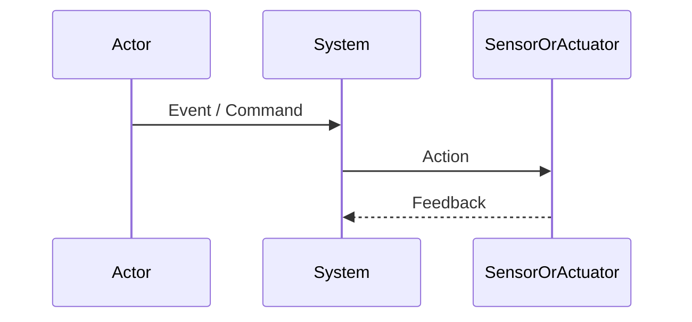

# Lab 3 – Individual Worksheet: V-Model and Traceability

> **Course:** CS G523 – Software for Embedded Systems  
> **Student Name:**  
> **Project:**  
> **Team:**  

---

## Objective

This worksheet captures **individual reasoning** about how requirements are:
- realized through interactions (design),
- verified through tests.

This is an **individual exploratory artifact** and will be consolidated
at the group level.

---

## 1. Selected Requirements

Select **two requirements** from the finalized **group Lab 2 submission**.

| Requirement ID | Requirement (brief description) |
|----------------|---------------------------------|
| R-1 | |
| R-2 | |

---

## 2. Sequence Diagram(s)

Create **sequence diagram(s)** corresponding to the selected requirements.

- You may draw two separate diagrams, or one combined diagram if interactions overlap.
- Use **Mermaid** syntax.

### Sequence Diagram A (for R-1)



### Sequence Diagram B (for R-2) (if required)


---

## 3. Test Artifacts

For **each requirement**, define **one test artifact**.

### Test for Requirement R-1
- **Setup:**  
- **Procedure:**  
- **Pass criteria:**  

### Test for Requirement R-2
- **Setup:**  
- **Procedure:**  
- **Pass criteria:**  

---

## Reflection (Optional)

Briefly note any ambiguity or difficulty in mapping requirement → interaction → test.
```


```