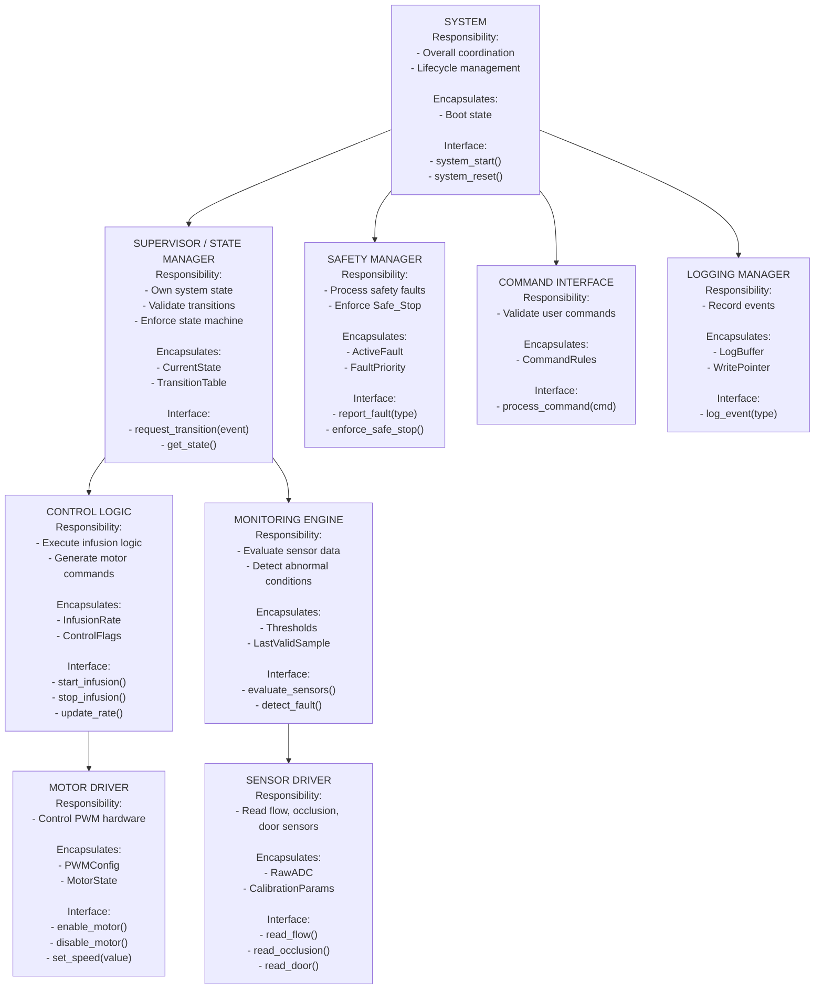

## Hierarchy of Control Diagram

---

## Dependency Constraints

Allowed:
- UI → Supervisor
- Supervisor → Control
- Supervisor → Safety
- Monitor → Supervisor (via event)
- Control → MotorDriver
- Monitor → SensorDriver
- All modules → Logger (one-way logging only)

Forbidden:
- Drivers calling upward
- Logger influencing control
- Safety depending on UI
- Control directly accessing SensorDriver

Global State Policy:
- Only Supervisor owns CurrentState.
- No shared mutable globals between modules.

---

## Behavioral Mapping

| Module | Related States | Related Transitions | Related Sequence Diagrams |
|--------|---------------|--------------------|---------------------------|
| Supervisor | Idle, Infusing, Alarm, Safe_Stop | All | All |
| Safety | Alarm, Safe_Stop | OcclusionDetected, DoorOpen, PowerLoss | Occlusion, Power Loss |
| Control | Infusing | StartCommand, StopCommand | Normal Infusion |
| Monitor | None (observer) | Generates OcclusionDetected | Normal + Occlusion |
| MotorDriver | None | Actuation | All |
| SensorDriver | None | Sensor Input | All |

---

## Interaction Summary

| Module | Calls | Called By | Shared Data? |
|--------|-------|----------|-------------|
| Supervisor | Control, Safety | UI | No |
| Safety | Supervisor | Monitor | No |
| Control | MotorDriver | Supervisor | No |
| Monitor | SensorDriver, Safety | Supervisor | No |
| Logger | None | All | No |
| Drivers | None | Control / Monitor | No |

---

## Architectural Rationale

### Organizational Style: Coordinated Controllers

The architecture follows a coordinated controller model:

- A central Supervisor / State Manager owns system state.
- Functional modules (Control, Monitoring) coordinate through it.
- Safety logic exists as a parallel supervisory component.

System control authority resides in: **Supervisor / State Manager**  
System state is owned by: **Supervisor / State Manager**

Safety logic is separated from normal control so that faults can override operation without depending on UI or logging.

---

## Task Split

| Member | Module(s) Owned |
|--------|------------------|
| A | Supervisor |
| B | Safety |
| C | Monitoring Engine |
| D | Control Logic |
| E | Drivers + Logger |

---

## Individual Module Specification

### (Example: Supervisor)

#### Purpose and Responsibilities
Maintain system state and enforce valid transitions.

#### Inputs
- Events from UI
- Fault events from Safety
- Commands from Control

#### Outputs
- Calls to Control
- State changes

#### Internal State
- CurrentState
- TransitionTable

#### Initialization / Deinitialization
- Init: Set state to Idle
- Reset: Enter Safe_Stop

#### Basic Protection Rules
- Reject invalid transitions
- Safe_Stop reachable from any state
- Log invalid transition attempt

#### Module-Level Tests

| Test ID | Purpose | Stimulus | Expected Outcome |
|---------|--------|----------|-----------------|
| T-S1 | Reject invalid transition | Alarm→Infusing | Rejected |
| T-S2 | Valid transition | Idle→Infusing | Accepted |

---

## Architectural Risk

### Identified Risk
Monitoring Engine and Safety Manager are tightly coupled via fault reporting.

### Mitigation
Introduce confirmation logic and debounce mechanisms in future fault-handling refinement.
